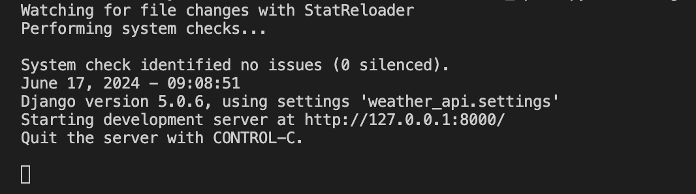
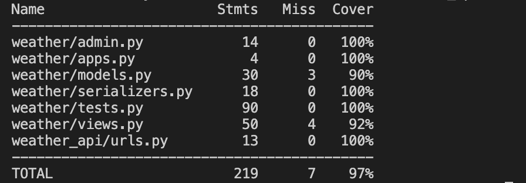
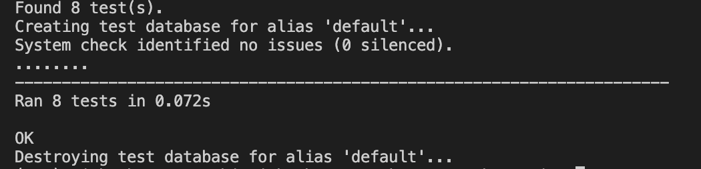
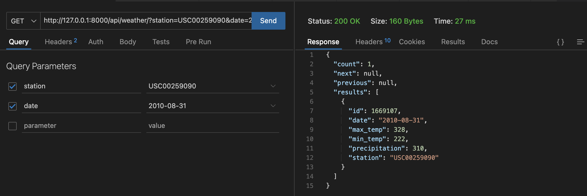
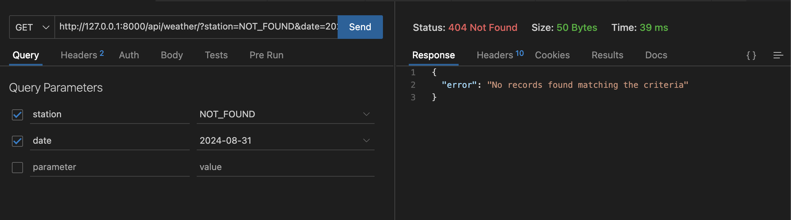
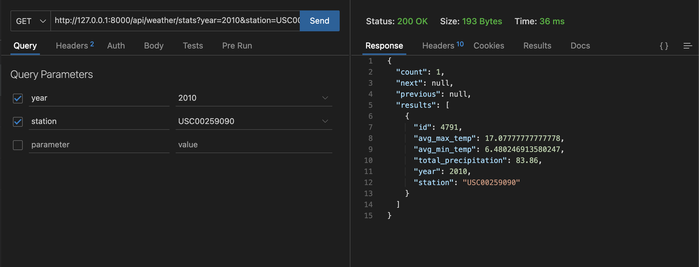
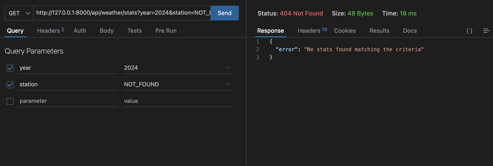
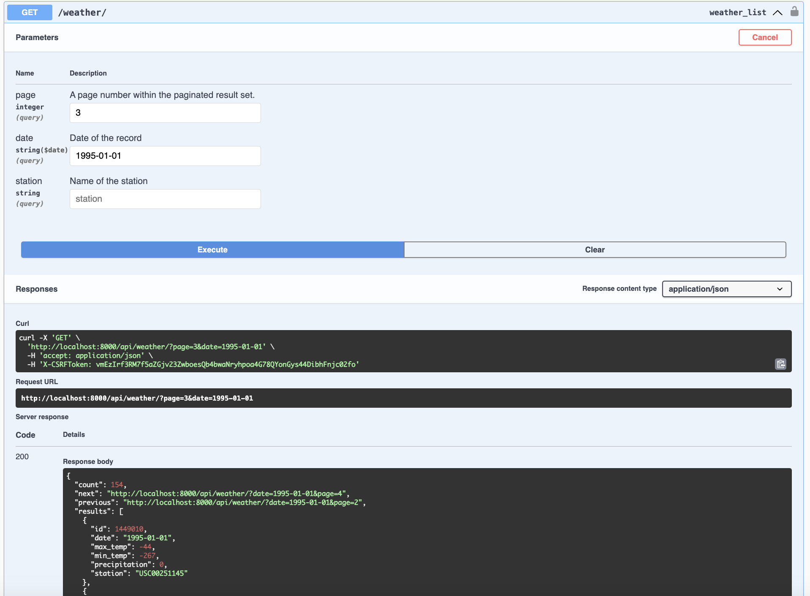

# Weather API with Django
There are 4 endpoints in this project:-
  1. `/api/weather/`
  2. `/api/weather/stats/`
  3. `/swagger`
  4. `/redoc`

# Project Structure
```bash
.
├── env/
└── weather_api/
    ├── data/
    │   ├── wx_data/
    │   └── yld_data
    ├── screenshots/
    ├── weather/
    │   ├── management/
    │   │   └── commands/
    │   │       └── dump_data.py
    │   ├── __init__.py
    │   ├── admin.py
    │   ├── apps.py
    │   ├── models.py
    │   ├── serializers.py
    │   ├── tests.py
    │   └── views.py
    ├── weather_api/
    │   ├── __init__.py
    │   ├── asgi.py
    │   ├── settings.py
    │   ├── urls.py
    │   └── wsgi.py
    ├── .coverage
    ├── .coveragerc
    ├── .env
    ├── approach.md
    ├── manage.py
    ├── readme.md
    ├── requirements.txt
    └── script.log
```
# Project Setup and Installation
1. Download and unzip the project
2. Create and activate a virtual environment using the below commands:-
```bash
  python -m venv env
  source env/bin/activate # (For Mac and Linux)
  env\Scripts\activate # (For Windows)
```
3. Run the below command to install the required packages:-
```bash
  pip install -r requirements.txt
  ```
# Database Setup and Installation
1. Download and Install PostgreSQL in your computer using this [link](https://www.postgresql.org/download/).
2. Create a database using below command:-
```bash
CREATE DATABASE database_name;
```
# Setup environment variables
Create a .env file and store your database credentials in below format:-
```bash
DB_NAME='database_name'
DB_USER='username_of_postgres'
DB_HOST='host_of_postgres'
DB_PASSWORD='password_of_postgres'
```
# Run project
1. Run the below make migrations
```bash
python manage.py makemigrations
python manage.py migrate
```
2. Run the below command to load the data
```bash
python manage.py dump_data
```
3. Run the server using below command
```bash
python manage.py runserver
```


# To access the API endpoints
```bash
/api/weather/  #for weather records
/api/weather/stats/  #for weather stats
/swagger #for swagger documentation
/redoc #for redoc documentation
```
# Testing
To run the testcases use this command:-
```bash
python manage.py test
```
# Coverage
To get the coverage use this command:-
```bash
coverage run --source='.' manage.py test
coverage report
```


### Screenshot of Testcase output


### Screenshots of API Response

<br><br>

<br><br>

<br><br>


### Screenshots of Swagger Response

<br><br>

